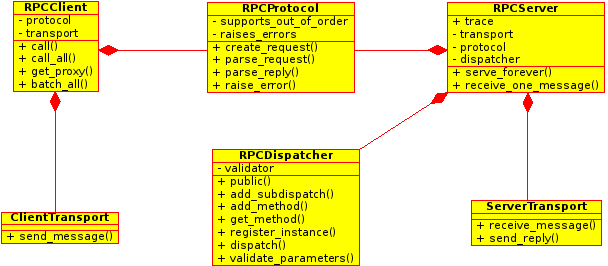

Structure of tinyrpc
====================

Architecture
------------

``tinyrpc`` is constructed around the :py:class:`~tinyrpc.server.RPCServer` and
:py:class:`~tinyrpc.client.RPCClient` classes.

They in turn depend on the :py:class:`~tinyrpc.dispatch.RPCDispatcher`,
:py:class:`~tinyrpc.protocols.RPCProtocol`, :py:class:`~tinyrpc.transports.ServerTransport`
and :py:class:`~tinyrpc.transports.ClientTransport` classes as visualized in the image below.

Of these :py:class:`~tinyrpc.protocols.RPCProtocol`,
:py:class:`~tinyrpc.transports.ServerTransport` and
:py:class:`~tinyrpc.transports.ClientTransport` are abstract base classes.

Each layer is useful "on its own" and can be used separately.
If you just need to decode a jsonrpc_ message, without passing it on or sending it through
a transport, the :py:class:`~tinyrpc.protocols.jsonrpc.JSONRPCProtocol`-class is completely usable
on its own.

Likewise the :py:class:`~tinyrpc.dispatch.RPCDispatcher` could be used to dispatch calls in a
commandline REPL like application.

Transport
---------

The transport classes are responsible for receiving and sending messages.
No assumptions are made about messages, except that they are of a fixed size.
Messages are received and possibly passed on as Python :py:class:`bytes` objects.

In an RPC context, messages coming in (containing requests) are simply called
messages, a message sent in reply is called a reply. Replies are always
serialized responses.

Protocol
--------

The protocol class(es) are responsible for two tasks:

* they implement the protocol, defining how method names, method parameters and errors are represented in requests and responses.
* they serialize the requests and responses into messages and deserialize messages back into requests and responses.

Dispatcher
----------

:doc:`dispatch` performs the actual method calling determining with method to call and how to
pass it the parameters.
The result of the method call, or the exception if the call failed is assembled and made available
to the protocol for serialization.

Client and Server
-----------------

The client and server classes tie all components together to provide the application interface.

.. _jsonrpc: http://jsonrpc.org
